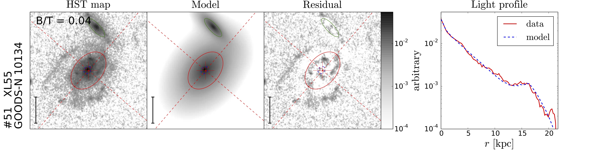

<h2>PHIBSS2 bulge/disc decomposition scheme</h2>

These python programs enable to carry out bulge/disc decompositions on Hubble Space Telescope (HST) images of galaxies as in the PHIBSS2 article <a href="https://ui.adsabs.harvard.edu/abs/2019A%26A...622A.105F/abstract"  style="text-decoration:none" class="type1">Freundlich et al. (2019)</a>. The scheme is based on <a href="https://users.obs.carnegiescience.edu/peng/work/galfit/galfit.html"  style="text-decoration:none" class="type1">galfit</a> (<a href="https://ui.adsabs.harvard.edu/abs/2002AJ....124..266P/abstract"  style="text-decoration:none" class="type1">Peng et al. 2002</a>, <a href="https://ui.adsabs.harvard.edu/abs/2010AJ....139.2097P/abstract"  style="text-decoration:none" class="type1">Peng et al. 2010</a>). It aims at compensating for galfit's sensitivity to the initial  guesses and the resulting degeneracy of the solutions when carrying out two-component fits. The method is explained in <a href="BT_method.pdf"  style="text-decoration:none" class="type1">BT_method.pdf</a> ("Method followed in this paper") together with discussions on other methods used in the litterature. It was used in the following article: 

<a href="https://ui.adsabs.harvard.edu/abs/2019A%26A...622A.105F/abstract"  style="text-decoration:none" class="type1"><b>PHIBSS2: survey design and z = 0.5 - 0.8 results. Molecular gas reservoirs during the winding-down of star formation</b></a> 
<a href="https://ui.adsabs.harvard.edu/link_gateway/2019A%26A...622A.105F/PUB_PDF" style="text-decoration:none" class="type1"> [PDF] </a>

 The main program is <a href="BT_run.py"  style="text-decoration:none" class="type1">BT_run.py</a>. The method involves a preliminary study to obtain the relation between the bulge/disc size ratio (Rb/Rd), bulge-to-total light ratio (B/T) and the Sersic fit parameters, used to set a grid of initial guesses for the two component fits. The program doing this preliminary study is <a href="Sersic_ideal.py"  style="text-decoration:none" class="type1">Sersic_ideal.py</a>: it generates mock observations of bulge+disk systems and fits them with a single Sersic profile. The program <a href="BT_figure.py"  style="text-decoration:none" class="type1">BT_figure.py</a> plots the initial image, best-fit two-component model, residuals, and averaged radial profile. Satellite galaxies can be modelled simultaneously with a single Sersic profile. 

<h4 align="justify">Steps followed by this bulge/disc decomposition scheme:</h4>
<ol>
  <li>Empirical study of the single-component Sérsic indices of noise-free two-component bulge disk systems.</li>
  <li>Single-Sérsic fits to the observed galaxies.</li>
  <li>One-component pure disk and pure bulge fits to the galaxies.</li>
  <li>Two-component bulge disk fits to the galaxies with different initial guesses.</li>
  <li>Best-fit model selection based on the lowest reduced chi-square.</li>
</ol>

 

